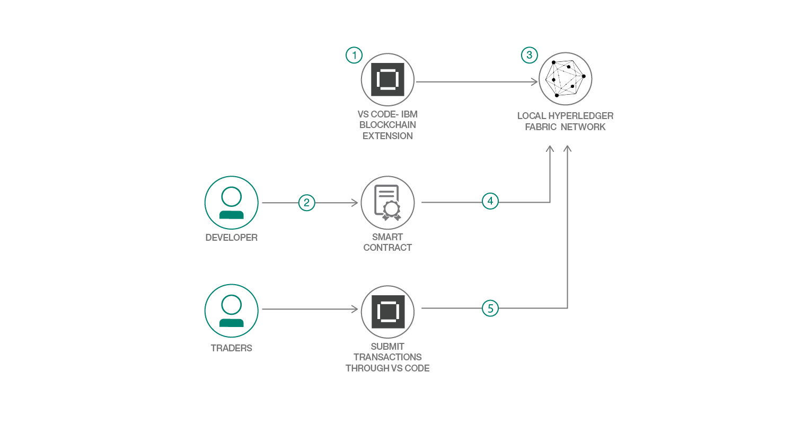
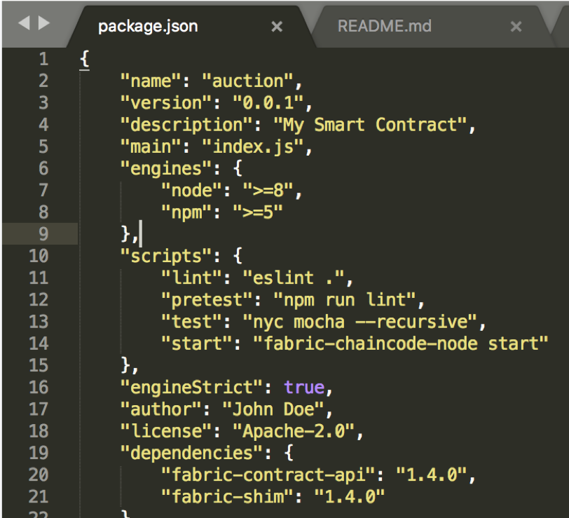
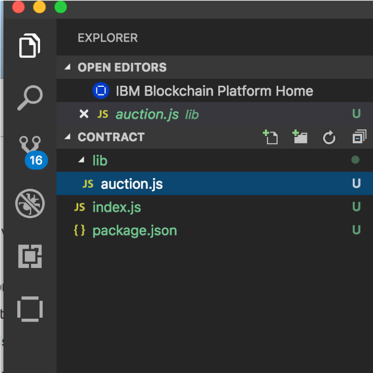
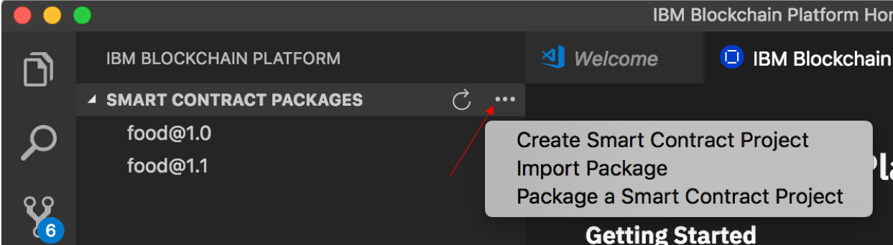
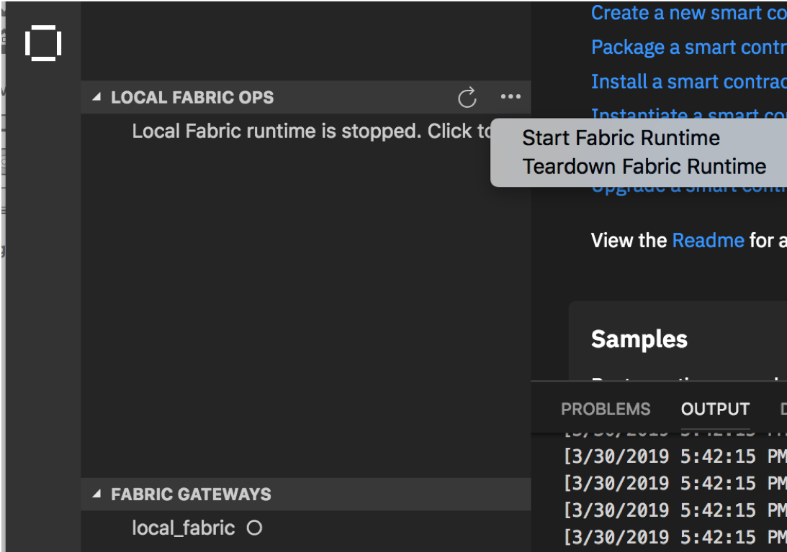
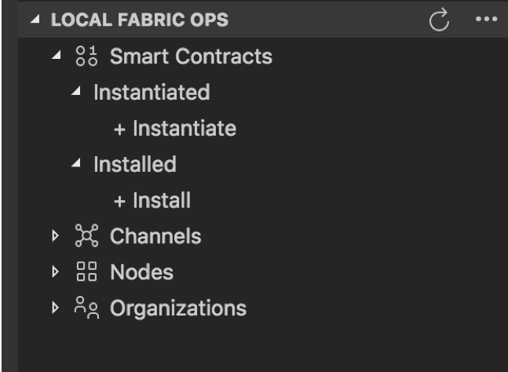
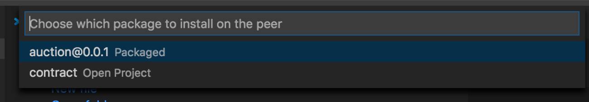
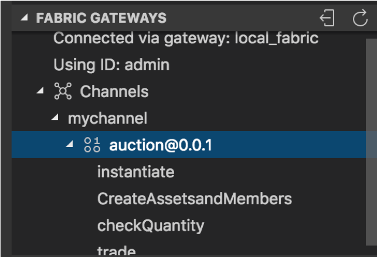
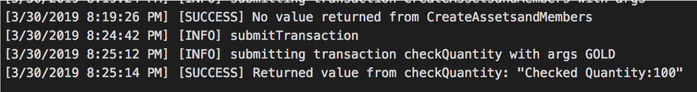
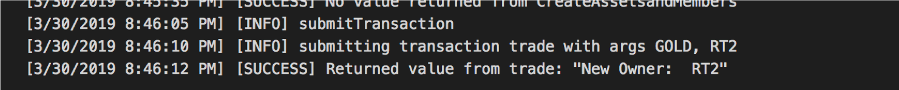

# SmartContractTrading-wFabric1-4-VSCodeExt

>SmartContract Trading using IBM Blockchain Platform Extension for VSCode (supports Fabric 1.4)

Welcome to Part 2 of the Hyperledger Composer Composite Pattern. This is a continuation of [Create a Blockchain Network on IBP V2.0](https://github.com/IBM/Create-BlockchainNetwork-IBPV20).  You should be already familiar with setting up a network in VSCode or IBP V2.0 from the previous pattern in this series. This pattern focuses on how you create a smart contract. The Smart Contract is at the heart of a blockchain network. It enables a participant to change the state of an asset. In this use case, the assets are `Commodities` and `Traders` and the participant is able to execute the following transactions or smart contracts: `Trade` or `CheckQuantity`. IBM Blockchain Platform Extension for VSCode makes it very easy to create and test out smart contracts.  Let's give it a try.

When you have completed this code pattern, you will understand how to use the IBM Blockchain Platform Extension for VSCode to:

* Create a smart contract 
* Package the smart contract
* Install and instantiate a smart contract package
* Test the smart contracts

# Architecture flow

  

1. Setup and launch the VSCode Platform
2. Develop a smart contract using Node.js
3. Start a local instance of a Fabric Network within the VS Code Platform
4. Install and instantiate the smart contract 
5. Test out the smart contract transactions 

# Included components
* [IBM Blockchain Platform Extension for VS Code](https://marketplace.visualstudio.com/items?itemName=IBMBlockchain.ibm-blockchain-platform) is designed to assist users in developing, testing, and deploying smart contracts -- including connecting to Hyperledger Fabric environments. 

## Featured technologies
+ [Hyperledger Fabric v1.4](https://hyperledger-fabric.readthedocs.io) is a platform for distributed ledger solutions, underpinned by a modular architecture that delivers high degrees of confidentiality, resiliency, flexibility, and scalability.
+ [Node.js](https://nodejs.org) is an open source, cross-platform JavaScript run-time environment that executes server-side JavaScript code.

### Prerequisites
- [Node v8.x or greater and npm v5.x or greater](https://nodejs.org/en/download/)
- [VSCode version 1.26 or greater](https://code.visualstudio.com)
- [IBM Blockchain Platform Extension for VSCode](https://marketplace.visualstudio.com/items?itemName=IBMBlockchain.ibm-blockchain-platform)
- [Yeoman](https://yeoman.io/)

# Running the application

Follow these steps to set up and run this code pattern. The steps are described in detail below.

### Steps

1. [Install the prerequisites](#1-install-the-prerequisites)
2. [Clone the repo](#2-clone-the-repo)
3. [Edit package json file](#3-edit-package-json-file)
4. [Create the smart contract](#4-create-the-smart-contract)
5. [Package the smart contract](#5-package-the-smart-contract)
6. [Start the local network](#6-start-the-local-network)
7. [Install and Instantiate the Smart Contract](#7-install-and-instantiate-the-smart-contract)
8. [Test the transactions](#8-test-the-transactions)

## 1. Install the Prerequisites

Ensure you have the following installed

* Visual Studio Code
* Visual Studio Code Extension
- Navigate to the Visual Studio Code Extension marketplace page
- Click **Install**
- Restart Visual Studio Code to complete the installation of the extension

If you are using Windows, you must also ensure the following:

* Your version of Windows supports Hyper-V and Docker:
* Windows 10 Enterprise, Pro, or Education with 1607 Anniversary Update or later
* Docker for Windows is configured to use Linux containers (this is the default)
* You have installed the C++ Build Tools for Windows from windows-build-tools
* You have installed OpenSSL v1.0.2 from Win32 OpenSSL
* Install the normal version, not the version marked as “light”
* Install the Win32 version into C:\OpenSSL-Win32 on 32-bit systems
* Install the Win64 version into C:\OpenSSL-Win64 on 64-bit systems

You can check your installed versions by running the following commands from a terminal:

* node --version
* npm --version
* yo --version
* docker --version
* docker-compose --version

Once you have installed Visual Studio Code, the first thing you need to do is to install the IBM Blockchain Platform VSCode extension. To do this, you need to install the latest version of VSCode; to see if you have the latest VSCode extension, go to `Code` > `Check for Updates`. If VSCode crashes at this point, it likely means you don’t have the latest version. Update your VSCode, and once you’re done, click on extensions in the sidebar on the left side of your screen. At the top, search the extension marketplace for `IBM Blockchain Platform`. Click `Install` and then click reload. Now you should be all set to use the extension!

## 2. Clone the repo

Clone this repository in a folder of your choice

                `git clone https://github.com/IBM/SmartContractTrading-wFabric1-4-VSCodeExt.git`

## 3. Edit Package JSON File

The first thing you need to do is edit the `Package.json` file. In this file - you will need to state the name of the smart contract. In this instance we will call it `auction`.

  

You can also supply a description.

## 4. Create the Smart Contract

Recall from the intro that the Smart Contract defines the different state of an object or asset.  Additionally, it governs the processes or transactions that can occur that moves the object between different states.  Developers use smart contracts to define the key business processes and data that can be shared across organizations within a blockchain network.

The next task is to edit the provided smart contract and code up the transactions. A copy of this pattern's smart contract is contained in `\contract\lib\auction.js`.  Take a look at it in more detail.

You will see that at the top of it, the requirement for the fabric contract API package and we are extending the contract class:

                     `class Auction extends Contract {`

The first function that is called when the smart contract is instantiated is called `instantiate`.  Sometimes you will see developers call it `init`.

The next function `CreateAssetsandMembers` which will actually write data to the fabric network.

In this function, we are creating 2 instances of the Commodity asset (Gold & WonderDrug) and 2 instances of a Trader participant (SI1 and RT2). 
Note the example of creating an asset:

          					`var commKey = 'GOLD';
                     var commodity = { 
                       docType: 'commodity', 
                       description: 'Yellow Bars',
                       mainExchange: 'London',
                       quantity: 100,
                       owner: 'SI1'
                    };`

The data being written to the ledger are created as JSON objects that are then 'stringified' with this command:

                    `await ctx.stub.putState(commKey, JSON.stringify(commodity));`

We will add a `checkQuantity` function to query or read from the network.  We will use the `getState()` method from the smart contract context to read the data and then pass in the output into a JSON object.  This transaction function will take the Hyperledger Fabric context and one argument, `commKey`, which identifies which commodity to process the transaction against.

                    `let commodityBytes = await ctx.stub.getState(commKey);`

The last thing we will do is execute a trade where a new owner gets assigned a new commodity.  The logic requires you first read the data from the ledger, validate it and then a new block to the ledger assigning a new owner to the commodity.  Assuming everything is valid, we will make the update using the `putState` method.

                     `await ctx.stub.putState(commKey, JSON.stringify(commodity));`

Voila' You have completed writing the smart contract.

## 5. Package the smart contract

Now that your smart contract is written - we need to install it and instantiate it on the network using the IBM Blockchain Platform VSCode Extension

* If you didn't create the code inside of VSCode - you will need to add the `contract` folder into the tool.  You will see this:
  

  

**Note** - it is important - if you get an error about not recognizing the programming language, ensure you **only** loaded the `contract` directory and not your whole `github` directory.

* Click the `IBM Blockchain Platform` extension button (it looks like a square all the way on the bottom of the left sidebar). This will show the packaged contracts on top and the blockchain connections on the bottom.

  

* Next, click on the 3 dots and select `Package a Smart Contract Project`.  You will see the following once your project has been packaged.

  

## 6. Start the Local Network

Now you are ready to deploy to the local fabric network. Before you can install the smart contract on the network, you need to first connect to a network.  The network that comes with the VSCode extension is perfect for development — it offers the minimal resources to develop and test your contract. The following Docker containers are started on your local machine, each with a different role in the network: `Orderer, Certificate Authority, CouchDB, and Peer`.

* Click on the extension, you should see LOCAL FABRIC OPS on the left side of the editor. To the right of LOCAL FABRIC OPS you should see a three-dot symbol. Click that, and then click on Start Fabric Runtime.

Your extension will now provision those Docker containers that will act as nodes in your network. Once the provisioning is finished, you should see a Smart Contracts section under LOCAL FABRIC OPS.

  

When you have the network up and running - you will see this in VSCode:

  

## 7. Install and instantiate the smart contract

Now that the Fabric network is running, we need to install our smart contract onto the peer.  

### Install

* In the `Local Fabric Ops` section near the bottom, click on `Install`.  You will see a pop-up similar to the graphic below. 

  

* Then select the packaged contract: `auction@0.0.1 Packaged`  **Note** The 0.0.1 comes from your `package.json` line:  `"version": "0.0.1"`

After the install is complete, you should get a message `Successfully installed on peer peer0.org1.example.com`.  You should also see that the contract is listed under `Installed` under `Local Fabric Ops`.

### Instantiate

* Under **Smart Contracts** you will see a section that says **Instantiated**. Click on `+ Instantiate`.

* The extension will then ask you which contract and version to instantiate — choose `auction@0.0.1`.

* The extension will then ask you which function to call — type in `instantiate`

* Next, it will ask you for the arguments. There are none, so just hit enter.

* Lastly, the extension will then ask you do you want to use a provide a private data collect configuration file? - Click on `no`.

You should get the message `Successfully instantiated smart contract` and see `auction@0.0.1` under `Instantiated` under `Local Fabric Ops`.

## 8. Test the transactions

You can test out the transactions right in the VSCode platform.  Under the `Fabric Gateways` section, click on `local_fabric`, then click on `mychannel`, then click on `auction@0.0.1`  - expand it to show the following:

  

Notice that all of the transactions that you created in the `auction.js` file are listed.  If you right-hand click on the `CreateAssetsandMembers` transaction and then select `submit transaction`, a pop-up will come up. Hit return (don't enter any options), you should get a response that the transaction was successfully submitted. 

At this point, you will have created the 2 instances of commodities and 2 instances of traders.

Now let's submit the `checkQuantity` transaction.  Similarly, right-hand click on the the `checkQuantity` transaction. This time you do have to enter an option. It has to be in a `["key", "value"]` format.  Enter `"commodity", "GOLD"` as a parameter. You should see the following response in your output window:

  

Now let's submit the `trade` transaction.  Enter `"GOLD", "RT2"` as parameters. You should see the following response in your output window:

  

## Extending the code pattern
You learned how to create, package, install, instantiate and invoke a smart contract using the VSCode Platform that supports IBM Blockchain Platform. If you want to extend this pattern:

* You can leverage a network instantiated using the [IBM Blockchain Platform V2.0 Service](https://console.bluemix.net/catalog/services/blockchain) along with [IBM Cloud Kubernetes Service](https://www.ibm.com/cloud/container-service) on [IBM Cloud](https://www.ibm.com/cloud
). 

* You can write a standalone application that executes the transactions. You can learn more about these extensions in the third pattern of this series. [Emit events from Blockchain Platform 2.0](https://developer.ibm.com/patterns/implementing-blockchain-events-using-ibp-vscode-extension/)

* Create a wallet for every member and use the member's wallet to interact with the application.

* Add a UI application in place of the `invoke.js` node application to execute the transactions.

## Links
* [Hyperledger Fabric Docs](http://hyperledger-fabric.readthedocs.io/en/latest/)
* [Zero to Blockchain](https://www.redbooks.ibm.com/Redbooks.nsf/RedbookAbstracts/crse0401.html?Open)
* [IBM Code Patterns for Blockchain](https://developer.ibm.com/patterns/category/blockchain/)

## License
This code pattern is licensed under the Apache Software License, Version 2. Separate third-party code objects invoked within this code pattern are licensed by their respective providers pursuant to their own separate licenses. Contributions are subject to the [Developer Certificate of Origin, Version 1.1 (DCO)](https://developercertificate.org/) and the [Apache Software License, Version 2](https://www.apache.org/licenses/LICENSE-2.0.txt).

[Apache Software License (ASL) FAQ](https://www.apache.org/foundation/license-faq.html#WhatDoesItMEAN)

